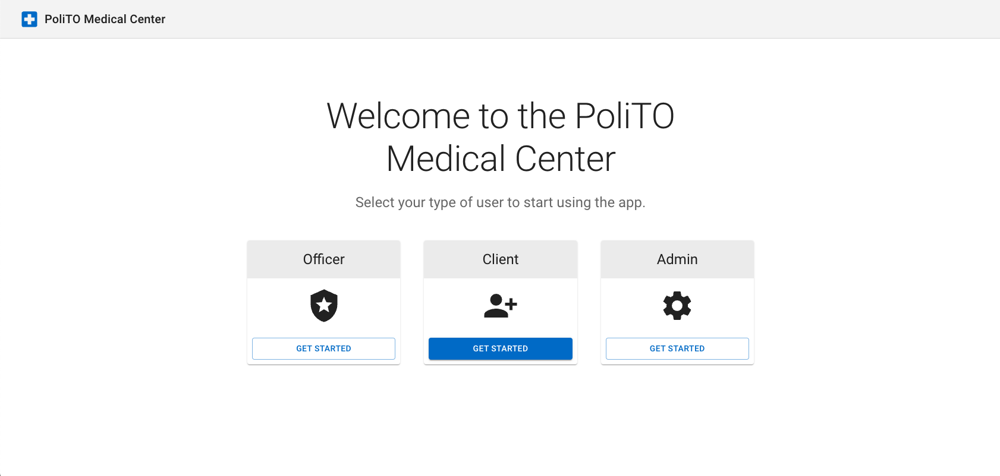
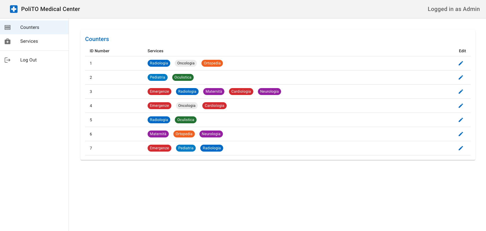
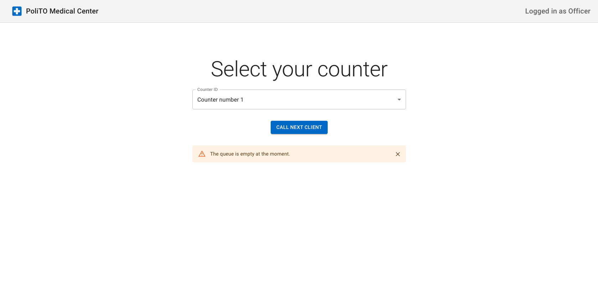

# Office Queue Management System

## Requirements

- Node.js (v18)
- npm

## Running

- Run `npm install` to install dependencies
- Run `npm run dev` to start the client
- Run `npm run start` to start the server

## Testing

- Run `npm run test` to run tests

## React Client Application Routes

- Route `/`: landing page of the application
- Route `/admin`: admin dashboard
- Route `/admin/counters`: counters table view
- Route `/admin/edit-counters/:counterId`: edit counter form
- Route `/admin/services`: services table view
- Route `/officer`: officer control panel to call next client
- Route `/client`: client page to get a new ticket
- Route `/*`: error route page

## API Server

All commands have to be done in the `server` folder.

### API Endpoints

- GET `/`
  - parameters: none
  - response :
    - 200 : { message: string }
- GET `/counter/:counterId/callNextClient`
  - parameters:
    - counterId: number - the id of the counter
  - response :
    - 200 : { data: number } - the ticket number of the next client
    - 204 : { } - no client to call
    - 404 : { message: string } - counter with the given id not found
- GET `/service/:serviceId/getTicket`
  - parameters:
    - serviceId: number - the id of the service
  - response :
    - 200 : { data: number } - the ticket number of the client
    - 404 : { message: string } - service does not exists or is not provided by a counter

## Data structures

```json
{
    "services": [
        {
            "id": <number>,
            "name": <string>,
            "serviceTime": <number>
        }
    ],
    "counters": [
        {
            "id": <number>,
            "services": <number[]>,
            "clients": <number[]>,
            "servedClient": <number>
        }
    ]
}
```

Note: the clients property in "counters" is a queue of ticket numbers

## Main React Components

- `ErrorPage` (in `ErrorPage.jsx`): component used to handle wrong client routes
- `LandingPage` (in `LandingPage.jsx`): component used to access the app with a different role (client, officer or admin)
- `AdminPage` (in `AdminPage.jsx`): component used to access the admin dashboard and navigate the tabs
- `CountersTable` (in `CountersTable.jsx`): component used to display all the counters and related services each counter has
- `CountersForm` (in `CountersForm.jsx`): component used to add or remove services from a specific counter
- `ServicesTable` (in `ServicesTable.jsx`): component used to display all the services and the metadata attached to each service
- `OfficerPage` (in `OfficerPage.jsx`): component used to access the officer dashboard and select a counter to call the next client in line

## Screenshots




